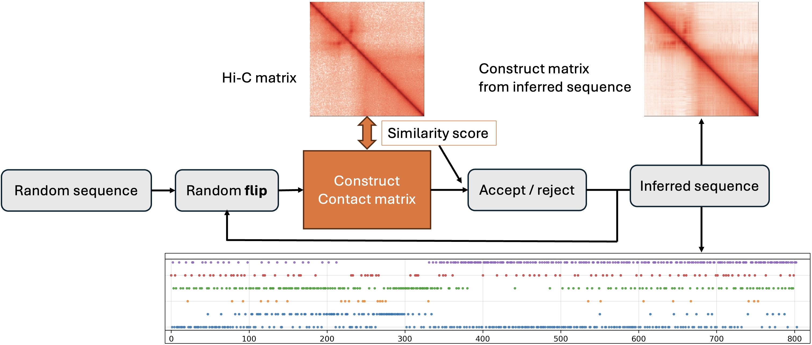
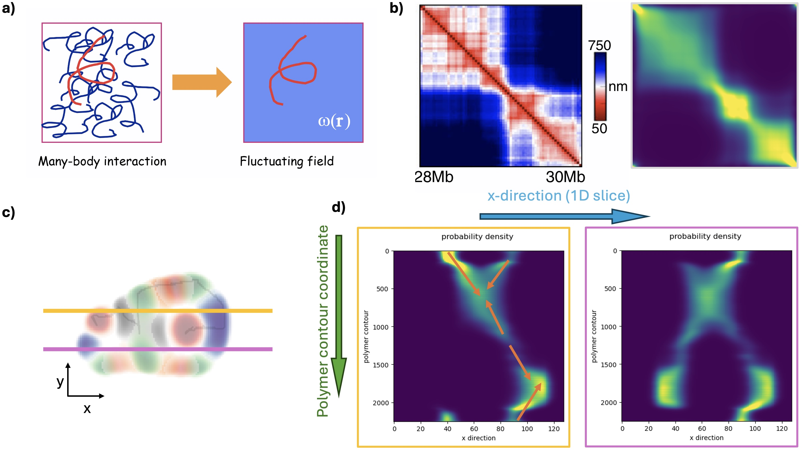
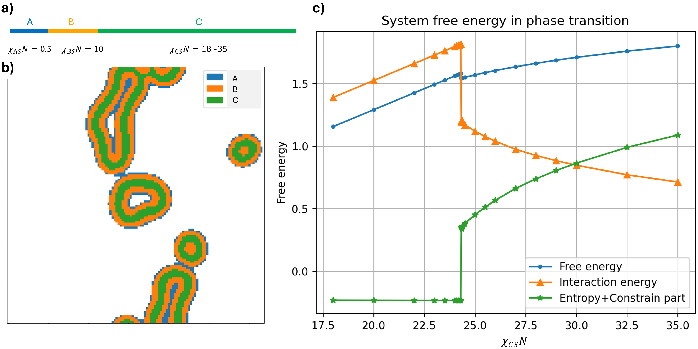

# SCFT_DNA

In this project we modeled the chromosome organization with self-consistent field theory of polymers. 

The full report can be found in `docs/Thesis_Public.pdf`, where more details about the algorithms and background are introduced.

## Project Structure

The code in this repository contains a full workflow: 
inferring the chromatin "binding sites" from Hi-C map; 
calculating polymer field with self-consistent field theory (SCFT);
and result interpretation of polymer conformation.

- `Bead_sequence_MC/`- Binding sites inferring
  - `IMR90_chr21_28_30_infer.ipynb` - The Jupyter Notebook that demonstrate the **binding sites inferring workflow** for Chr21 28-30Mb in IMR90 cells
  - `IMR90_long_sites_infer.ipynb` - For Chr21 30-42Mb in IMR90 cells.
  - `AB_compartment_analysis.ipynb` - **A/B compartment analysis** by from eigenvector or epigenetics.
  - `chr_xx_.npy` - Hi-C data stored in numpy matrix.
  - `IMR90_infer_sequence.npy` - Binding site sequence inferred.
  - `AB_binding_class_xx.npy` - A/B compartment annotation for the binding sites.
  - `data/` - Contain the Hi-C matrix (from meanfieldchromain example), theoretical contact profile (and h3k27 & rnaseq data, but not used for now)
  - `mf_chromatin_functions/` - Functions used in the Jupyter Notebook
- `SCFT_DNA/` - Self-consistent field theory and result analysis
  - `SCFT_functions/`- Functions used to **SCFT computation**
    - `computation_functions.py` - Computing field, density, mixing, and free energy
    - `QSR_solvers.py` - MDE pseudo-spectrum solvers; periodical BC for 2D and 3D, and no-flux BC for 3D
    - `QSR_dct.py` - no-flux BC for 2D
    - `loop_functions.py` - SCFT iteration process
  - `ABC_triblock/` - The ABC triblock copolymer example used as benchmark
    - `2D_SCFT_ABC.ipynb` - An example of the ABC polymer self-assembly computation.
    - `2D_ABC_parameter_sweep` - The parameter sweep demonstrating **free energy landscape in phase transition** vs $\chi_{PS}N$.
  - `2D_IMR90_parameter_sweep_phibar01.ipynb` - The parameter sweep of chromatin model (2 Mb segment) of $\chi_{PS}N$ and $\chi_{PP}N$.
  - `2D_AB_compartment_parameter_sweep.ipynb` - The parameter sweep of A/B compartment annotated chromatin model (12 Mb segment) of $\chi_{\text{offset}}N$.
  - `result_analysis\`
    - `contact_map.ipynb` - HiCRep score of SCFT contact map vs Hi-C data, as well as the decay profile, for the $\chi_{PS}N$ and $\chi_{PP}N$ parameter sweep.
    - `free_energy_landscape.ipynb` - Free energy landscape in the $\chi_{PS}N$ and $\chi_{PP}N$ parameter sweep.
    - `density_map.ipynb` - Polymer conformation and block localization in the $\chi_{PS}N$ and $\chi_{PP}N$ parameter sweep.
    - `AB_compartment_free_energy.ipynb` - Free energy change in the $\chi_{\text{offset}}N$ parameter sweep for A/B compartment analysis.
  - `3D_SCFT_IMR90` - 3D simulation for the 12 Mb segment.
  - `block_isosurface_IMR90.html` - 3D interactive plot of isosurface of polymer blocks.
  - `contour_isosurfaces.html` - 3D interactive plot of isosurface of polymer contour density distribution.
  - `DNA_input/` import sequence inferred to SCFT

## Project introduction

In this project, we implemented a two-part computational pipeline that connects the Hi-C maps to chromosomal spatial distributions during the interphase. 
The first part uses Monte Carlo method to infer the chromatin “binding-site” sequence (figure 1) which represents the effective interaction pattern along the locus that gives rise to the Hi-C map. 
The second part uses self-consistent field theory (SCFT) of polymers to predict the spatial distribution of a chromatin polymer (2M bp), with the sequence inferred in the first part.

*Figure 1: Workflow of the Monte Carlo process that infers the binding-site sequence. 
The predict contact matrix constructed from the inferred sequence the resembles closely the Hi-C map.*

The SCFT translates pairwise interactions between polymer segments into a chemical potential field and its conjugated polymer probability-density distribution (Figure 2a). 
In our model, the chromatin (2M bp) is represented as a Gaussian chain, and the field is calculated from the Flory-Huggins mixing of the polymer segment types obtained from the part I. 
From the SCFT solution, we computed the polymer density and sampled a representative single-chain conformation by following the positions of maximum polymer contour density (Figure 2c, d). 
The contact map (contour density overlap map) of this conformation shows a high similarity to the experimental median-distance map (Figure 2b)

*Figure 2: a) Schematic representation of SCFT framework. 
b) Comparison of median-distance map (left) and the contact map calculate from the SCFT result (right). 
c) Polymer density and most-probable single chain conformation (dark line). 
d) One-dimensional slices of the contour probability density. The positions of the two slices are indicated in (c).*

## Phase transition and energy landscape

Here we demonstrate how SCFT predicts polymer self-assembly with an ABC triblock copolymer in explicit solvent.
The polymer consists of a first 10\% contour length block A being hydrophilic with ($\chi_{AS} = 0.5)$, 
followed by a 15\% block B and a 75\% length block C that are hydrophobic, with $\chi_{BS} = 10$ and $\chi_{CS}$ ranging from 18 to 35. 
The $\chi$ between blocks is 15.
Figure 3b shows the polymer phase separate with solvent and self assemble into vesicles, where the most hydrophobic C part localized inside. 

Figure 3c shows the free energy, decomposed into enthalpic (interaction) and entropic contributions. 
In the homogeneous phase, the enthalpic contribution increases approximately linearly with $\chi_{CS}N$, whereas the entropic contribution is nearly constant. 
Once $\chi_{CS}N$ crosses the critical value, the entropic contribution exhibits an abrupt increase, reflecting the entropy penalty associated with forming an ordered, segregated morphology. 
In contrast, the enthalpic contribution decreases across the transition because segment~C becomes sequestered in the vesicle interior, thereby reducing unfavorable C--solvent contacts.
At phase transition, the entropy "jump" and enthalpy "drop" are approximately equal in magnitude, so the total free energy remains nearly continuous across the transition; 
For $\chi_{CS}N$ above the critical point, the entropic contribution continues to increase with $\chi_{CS}N$, while the enthalpic contribution decreases. 
The total free energy satisfies $\partial F / \partial (\chi_{CS}N) > 0$ throughout, but its slope changes abruptly at the critical point. This discontinuity in the first derivative is consistent with a first-order phase transition in the SCFT description.

*Figure 3: a) The ABC triblock polymer
b) The polymer conformation at $\chi_{CS} = 30$.
c) Enthalpic, entropic, and total free energy of the system. The first order phase transition happens at C, $\chi_{CS}N = 24.4$*

## Disclaimer: AI usage

Due to the time constrain, some of the code are implemented by ChatGPT or other AI models. 
This includes the data import & preprocessing in the sequence inferring part, and some of the plots for the SCFT result analysis.

However, the core features, including the SCFT algorithm and the simulated annealing Monte Carlo process, were implemented without any AI model.

## Other

The Monte Carlo method for finding the binding site sequence is largely inspired by

https://github.com/marianoimperatore/MeanFieldChromatin

and

Bianco, S., Lupiáñez, D. G., Chiariello, A. M., Annunziatella, C., Kraft, K., Schöpflin, R., Wittler, L., Andrey, G., Vingron, M., Pombo, A., Mundlos, S., & Nicodemi, M. (2018). Polymer physics predicts the e]ects of structural variants on chromatin architecture. Nature Genetics, 50(5), 662–667. https://doi.org/10.1038/s41588-018-0098-8
